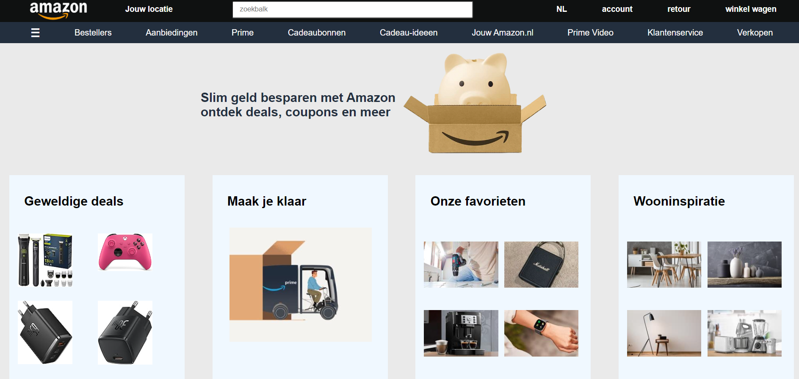
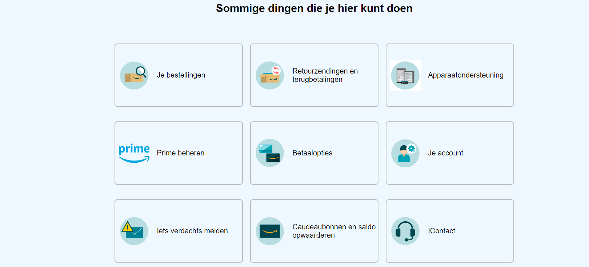

# Procesverslag
Markdown is een simpele manier om HTML te schrijven.  
Markdown cheat cheet: [Hulp bij het schrijven van Markdown](https://github.com/adam-p/markdown-here/wiki/Markdown-Cheatsheet).

Nb. De standaardstructuur en de spartaanse opmaak van de README.md zijn helemaal prima. Het gaat om de inhoud van je procesverslag. Besteedt de tijd voor pracht en praal aan je website.

Nb. Door *open* toe te voegen aan een *details* element kun je deze standaard open zetten. Fijn om dat steeds voor de relevante stuk(ken) te doen.

## Jij

  
uitwerken voor kick-off werkgroep

  ### Auteur:
  Caspar Euwes

  #### Je startniveau:
  Blauw

  #### Je focus:
  responsive
 

## Je website

  
uitwerken voor kick-off werkgroep

  ### Je opdracht:
  https://www.amazon.nl/ref=nav_logo
  https://www.amazon.nl/gp/help/customer/display.html?nodeId=508510&ref_=nav_cs_help

  #### Screenshot(s) van de eerste pagina (small screen): 
  Homepage
  

  #### Screenshot(s) van de tweede pagina (small screen):
  Klantenservice 
  
 

## Toegankelijkheidstest 1/2 (week 1)

  
uitwerken na test in 2e werkgroep

  ### Bevindingen
  Op Amazon:
  Er zitten niet altijd headings op elke pagina, soms zijn er ook geen alts bij images, met tab kan je vast komen zitten op de zoekbalk en de paginas hebben slechte titles.

## Breakdownschets (week 1)

  
uitwerken na afloop 3e werkgroep

Ik heb niet echt schetsen gemaakt voor de website, ben best snel gewoon aan de slag gegaan en gekeken wat ik voor elkaar kon krijgen.

## Voortgang 1 (week 2)

  
uitwerken voor 1e voortgang

  ### Stand van zaken
  Ging best prima, niet veel problemen nog, begonnen met de eerste pagina. Heb nu de eerste en tweede nav.

  ### Agenda voor meeting

  Niet echt met een groepje gewerkt maar heb een beetje met Colin overlecht over hoe ik bepaalde dingen het best kon aanpakken zoals de background.

  ### Verslag van meeting
  hier na afloop snel de uitkomsten van de meeting vastleggen

  - punt 1: heb divs gemaakt voor de producten maar kon ze niet goed naast elkaar krijgen, kreeg het advies om grid te gebruiken.
  - punt 2: zelfde advies voor de plaatjes in de divs

## Voortgang 2 (week 3)

  
uitwerken voor 2e voortgang

  ### Stand van zaken
  Had veel problemen met dat mijn website brak omdat niet alles erop paste, heb erg veel tijd versplit aan het opnieuw schrijven van mijn hele code.

  ### Agenda voor meeting

  heb Colin gevraagd of hij begreep waarom mijn website brak elke keer dat ik naar telefoon vormaat ging maar hij begreep het ook niet.

  ### Verslag van meeting
  hier na afloop snel de uitkomsten van de meeting vastleggen

  - punt 1: na het opnieuw maken van mijn website voor de 3de keer en met advies van de studenten assisten kreeg ik het voor elkaar om  de 2de nav scrollbaar te maken. Hierdoor breekt mijn website niet meer.
  - punt 2: ik loop nu best achter
  - punt 3: mijn divs breken nu weer mijn website omdat ze te veel ruimte in nemen

## Toegankelijkheidstest 2/2 (week 4)

  
uitwerken na test in 9e werkgroep

  ### Bevindingen
  Lijst met je bevindingen die in de test naar voren kwamen (geef ook aan wat er verbeterd is):

  Aangezien ik mijn website nog niet voledig af had waaren er best wel wat opmerkingen: de phone versie werkte nog niet zo goed, horizontal scrolling zit in mijn website, ik had nog wat problemen met ruimte tussen alles, ik had nog geen alts op mijn images gedaan en ik had nog niks gedaan met high contrast mode.

## Voortgang 3 (week 4)

  
uitwerken voor 3e voortgang

  ### Stand van zaken
  Ik heb mijn eerste pagina nu af maar moet nog kleine dingen verbeteren, tweede pagina is moeilijk te maken maar ik krijg langzaam het resultaat waar ik naar opzoek ben.

  ### Agenda voor meeting
  Colin gaat eerst met vragen stellen
  daarna kwam ik.

  ### Verslag van meeting
  hier na afloop snel de uitkomsten van de meeting vastleggen

  - punt 1: ik moet alle grid oefeningen opnieuw maken om ze beter te begrijpen.
  - punt 2: mijn 2de pagina doet niet precies wat ik wou.

## Eindgesprek (week 5)

  
uitwerken voor eindgesprek

  ### Je uitkomst - karakteristiek screenshots:
  

  ### Dit ging goed/Heb ik geleerd: 
  Korte omschrijving met plaatjes

  Gebreuk van grid ging goed, heb ervoor kunnen zorgen dat de plaatjes netjes naast de text staan en dat er niet meer dan 3 blokjes naast elkaar staan.

  

  ### Dit was lastig/Is niet gelukt:
  Korte omschrijving met plaatjes

  Wou dat de afbeeldingen er iets beter uitzagen en dat de witte blokjes iets dichter op elkaar zaten maar toen ik dat probeerde verpeste het alles op de telefoon.

  

## Bronnenlijst

  
continu bijhouden terwijl je werkt

  Nb. Wees specifiek ('css-tricks' als bron is bijv. niet specifiek genoeg). 
  Nb. ChatGpT en andere AI horen er ook bij.
  Nb. Vermeld de bronnen ook in je code.

  1. bron 1: Chat gpt: momenten waar ik even niet snapte hoe ik iets moest oplossen (andere margin, van px naar em of vh/vw) en high contrast mode colors
  2. bron 2: Kelvin(vriend) heeft soms geholpen uit te leggen waarom sommige problemen gebeurden met mijn code
  3. ...

